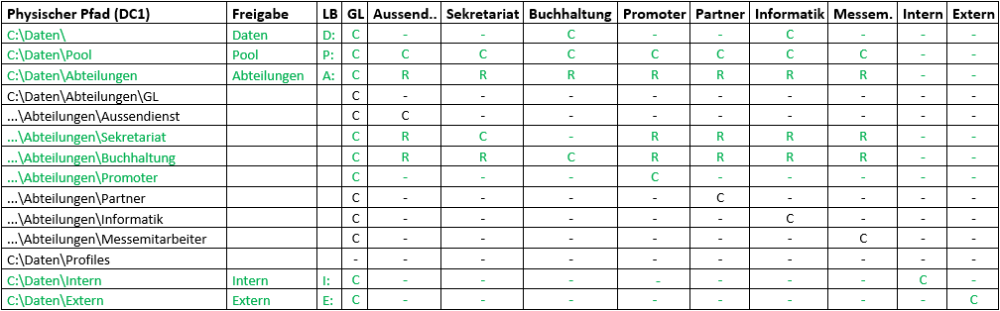

# Freigaben, Laufwerke & Berechtigungen

Für diese Aufgabe müssen Sie wissen, wie man Freigaben und Berechtigungen unter Windows verwendet. Falls Ihnen der Unterschied zwischen Freigabe- und NTFS-Berechtigungen nicht bekannt ist, Fragen Sie Ihre Klassenkameraden oder lesen Sie es im Internet nach. Falls Sie nicht sicher sind, Fragen Sie die Lehrperson.

## Ressourcen

- [Bewertungskriterien](../../../08_Kompetenznachweise/LB2/Kompetenzmatrix-LB2.md)
- [01_A_Planung_AD & Cloud Setup Sheet](../01_Planung/resources/01_A_Planung_AD_&_Cloud_Setup_Sheet.md)

## User und Gruppen anlegen

- Erstellen Sie Ihre wie in der Planung definiert
Falls Sie Probleme mit dem Anlegen der Benutzer haben, weil Ihre Passwörter zu schwach sind, ziehen Sie Aufgabe «9.1 Default Domain Policy - Verändern der Passwortrichtlinien» vor. Falls Sie überfragt sind, kann Ihnen die Lehrperson kurz helfen, da dieses Thema erst später im Modul behandelt wird.

- Erstellen Sie für jede Abteilung, sowie für intern und extern “globale” Sicherheitsgruppen. Intern und extern werden wie die Abteilungen als normale Sicherheitsgruppenerstellt. Anschliessend fügen Sie alle internen Abteilungen in die Gruppe intern und alle externen Abteilungen in die Gruppe extern. Welche Abteilung intern und extern sind finden Sie in der [Planung (8. Abteilungen & Benutzer)](..\01_Planung\resources\01_A_Planung_AD_&_Cloud_Setup_Sheet.md) 

- Fügen Sie die Benutzer in die entsprechenden Gruppen (Siehe Portfolio)

- Fügen Sie die Abteilungsgruppen in Gruppen intern und extern

- Testen Sie einige Benutzer, indem Sie sich mit diesem am Windows 10/11 Client anmelden

## UNC

Sie müssen wissen, wie UNC-Pfade aufgebaut sind und verwendet werden können

- https://de.wikipedia.org/wiki/Uniform_Naming_Convention

- https://gitlab.com/ch-tbz-it/Stud/m159/-/blob/main/02_Unterrichtsressourcen/04_%C3%9Cbungen/%C3%9Cbung UNC.docx

## Ordner und Freigaben erstellen + ABE aktivieren

- Erstellen Sie die Ordner- und Freigabestruktur wie in der Tabelle aufgeführt

- Setzen Sie für jede Freigabe die Freigabeberechtigungen für «Jeder» auf «ändern/change»

- Deaktivieren Sie die Vererbung auf der Freigabe «Daten» und allen Unterordnern

- Entfernen Sie die Standardgruppe «Domänenbenutzer»

- Vergeben Sie die NTFS-Berechtigungen aus der Matrix für sämtliche Ordner.

- Es reicht für die volle Punktzahl, nur die Berechtigungen der grün markierten Zeilen zu erfassen

LB = Laufwerksbuchstabe (Wird erst bei Aufgabe 9 für die Netzlaufwerk benötigt)

R = Read

C = Change

"-"  = Kein Zugriff

## Einige Berechtigungen testen

- Melden Sie sich mit dem Benutzer der Abteilung «Sekretariat» an. Prüfen Sie, ob Sie auf den UNC-Pfad «Buchhaltung» Leserechte haben.
- Melden Sie sich mit dem Benutzer der Abteilung «GL» an. Prüfen Sie, ob Sie auf den UNC-Pfad «Pool» Schreibrechte haben.
- Melden Sie sich mit dem Benutzer der Abteilung «Promoter» an. Prüfen Sie, ob Sie auf das Laufwerk «Aussendienst» keine Rechte haben.

## ABE

- Informieren Sie sich über ABE

- Aktivieren Sie anschliessend ABE für alle Freigaben

## Erstellen Sie Ihr eigenes "[Group Nesting](https://gitlab.com/ch-tbz-it/Stud/m159/-/blob/main/02_Unterrichtsressourcen/03_Fachliteratur&Tutorials/AGDLP-AGUDLP/Group-Nesting.md?ref_type=heads)" Konzept

- Überlegen Sie sich, wie Sie die vorgegebene Berechtigungsstruktur verbessern können.
- Erstellen Sie eine visualisierte Version der neuen Berechtigungsstruktur mit Rollengruppen & Berechtigungsgruppen basierend auf [AGDLP](https://www.youtube.com/watch?v=zHHzjjqVhTc&t=5s).
- Rekonfigurieren Sie zwei Abteilungen Ihre Umgebung entsprechend der neuen Planung.

