# Freigaben, Laufwerke & Berechtigungen

Für diese Aufgabe müssen Sie wissen, wie man Freigaben und Berechtigungen unter Windows verwendet. Falls Ihnen der Unterschied zwischen Freigabe- und NTFS-Berechtigungen nicht bekannt ist, Fragen Sie Ihre Klassenkameraden oder lesen Sie es im Internet nach. Falls Sie nicht sicher sind, Fragen Sie die Lehrperson.

## Ressourcen

- [Bewertungskriterien](../../../08_Kompetenznachweise/LB2/Kompetenzmatrix-LB2.md)
- [01_A_Planung_AD & Cloud Setup Sheet](../01_Planung/resources/01_A_Planung_AD_&_Cloud_Setup_Sheet.md)

## User und Gruppen anlegen

- Erstellen Sie Ihre wie in der Planung definiert
Falls Sie Probleme mit dem Anlegen der Benutzer haben, weil Ihre Passwörter zu schwach sind, ziehen Sie Aufgabe «9.1 Default Domain Policy - Verändern der Passwortrichtlinien» vor. Falls Sie überfragt sind, kann Ihnen die Lehrperson kurz helfen, da dieses Thema erst später im Modul behandelt wird.

- Erstellen Sie für jede Abteilung, sowie für intern und extern “globale” Sicherheitsgruppen. Intern und extern werden wie die Abteilungen als normale Sicherheitsgruppenerstellt. Anschliessend fügen Sie alle internen Abteilungen in die Gruppe intern und alle externen Abteilungen in die Gruppe extern. Welche Abteilung intern und extern sind finden Sie in der [Planung (8. Abteilungen & Benutzer)](..\01_Planung\resources\01_A_Planung_AD_&_Cloud_Setup_Sheet.md) 

- Fügen Sie die Benutzer in die entsprechenden Gruppen (Siehe Portfolio)

- Fügen Sie die Abteilungsgruppen in Gruppen intern und extern

- Testen Sie einige Benutzer, indem Sie sich mit diesem am Windows 10/11 Client anmelden

## UNC

Sie müssen wissen, wie UNC-Pfade aufgebaut sind und verwendet werden können

- https://de.wikipedia.org/wiki/Uniform_Naming_Convention

- https://gitlab.com/ch-tbz-it/Stud/m159/-/blob/main/02_Unterrichtsressourcen/04_%C3%9Cbungen/%C3%9Cbung UNC.docx

## Ordner und Freigaben erstellen + ABE aktivieren

- Erstellen Sie die Ordner- und Freigabestruktur wie in der Tabelle aufgeführt

- Setzen Sie für jede Freigabe die Freigabeberechtigungen für «Jeder» auf «ändern/change»

- Deaktivieren Sie die Vererbung auf der Freigabe «Daten» und allen Unterordnern

- Entfernen Sie die Standardgruppe «Domänenbenutzer»

- Vergeben Sie die NTFS-Berechtigungen aus der Matrix für sämtliche Ordner.

- Es reicht für die volle Punktzahl, nur die Berechtigungen der grün markierten Zeilen zu erfassen

LB = Laufwerksbuchstabe (Wird erst bei Aufgabe 9 für die Netzlaufwerk benötigt)

R = Read

C = Change

"-"  = Kein Zugriff

## Einige Berechtigungen testen

- Melden Sie sich mit dem Benutzer der Abteilung «Sekretariat» an. Prüfen Sie, ob Sie auf den UNC-Pfad «Buchhaltung» Leserechte haben.
- Melden Sie sich mit dem Benutzer der Abteilung «GL» an. Prüfen Sie, ob Sie auf den UNC-Pfad «Pool» Schreibrechte haben.
- Melden Sie sich mit dem Benutzer der Abteilung «Promoter» an. Prüfen Sie, ob Sie auf das Laufwerk «Aussendienst» keine Rechte haben.

## ABE

- Informieren Sie sich über ABE

- Aktivieren Sie anschliessend ABE für alle Freigaben

## Erstellen Sie Ihr eigenes "[Group Nesting](https://gitlab.com/ch-tbz-it/Stud/m159/-/blob/main/02_Unterrichtsressourcen/03_Fachliteratur&Tutorials/AGDLP-AGUDLP/Group-Nesting.md?ref_type=heads)" Konzept

- Überlegen Sie sich, wie Sie die vorgegebene Berechtigungsstruktur verbessern können.
- Erstellen Sie eine visualisierte Version der neuen Berechtigungsstruktur mit Rollengruppen & Berechtigungsgruppen basierend auf [AGDLP](https://www.youtube.com/watch?v=zHHzjjqVhTc&t=5s).
- Rekonfigurieren Sie zwei Abteilungen Ihre Umgebung entsprechend der neuen Planung.

```mermaid
flowchart TB

%% ===== GLOBAL GROUPS =====
subgraph GLOBAL["🌐  Global Groups"]
    G_BH["buchhaltung"]
    G_SEK["sekretariat"]
    G_PR["promoter"]
    G_GL["gl"]
end

%% ===== DOMAIN LOCAL GROUPS =====
subgraph LOCAL["👥  Domain Local Groups"]
    DL_BH_R["DL_Buchhaltung_R"]
    DL_BH_RW["DL_Buchhaltung_RW"]
    DL_SEK_R["DL_Sekretariat_R"]
    DL_SEK_RW["DL_Sekretariat_RW"]
end

%% ===== ORDNER / NTFS =====
subgraph FOLDERS["📁  Ordner (NTFS-Berechtigungen)"]
    F_BH["C:\\Daten\\Abteilungen\\Buchhaltung"]
    F_SEK["C:\\Daten\\Abteilungen\\Sekretariat"]
end

%% ===== VERBINDUNGEN =====
G_BH -- Mitglied --> DL_BH_RW
G_SEK -- Mitglied --> DL_SEK_RW
G_BH -- Lesen --> DL_SEK_R
G_SEK -- Lesen --> DL_BH_R
G_GL -- RWX --> DL_BH_RW & DL_SEK_RW
G_PR -- Lesen --> DL_BH_R & DL_SEK_R
DL_BH_R -- r --> F_BH
DL_BH_RW -- rwx --> F_BH
DL_SEK_R -- r --> F_SEK
DL_SEK_RW -- rwx --> F_SEK

%% ===== STYLES =====
style GLOBAL fill:#F5F5F5,stroke:#90A4AE,stroke-width:2px
style LOCAL fill:#F5F5F5,stroke:#90A4AE,stroke-width:2px
style FOLDERS fill:#F5F5F5,stroke:#90A4AE,stroke-width:2px

style G_BH fill:#FFCDD2
style G_SEK fill:#BBDEFB
style G_PR fill:#C8E6C9
style G_GL fill:#FFF9C4

linkStyle 0 stroke:#D50000,stroke-width:2px
linkStyle 1 stroke:#2962FF,stroke-width:2px
linkStyle 2 stroke:#D50000,stroke-width:2px
linkStyle 3 stroke:#2962FF,stroke-width:2px
linkStyle 4 stroke:#FFD600,stroke-width:2px
linkStyle 5 stroke:#FFD600,stroke-width:2px
linkStyle 6 stroke:#00C853,stroke-width:2px
linkStyle 7 stroke:#00C853,stroke-width:2px

```

 