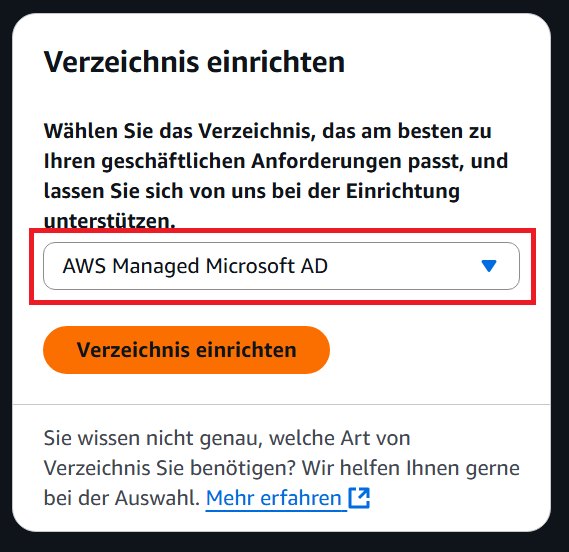
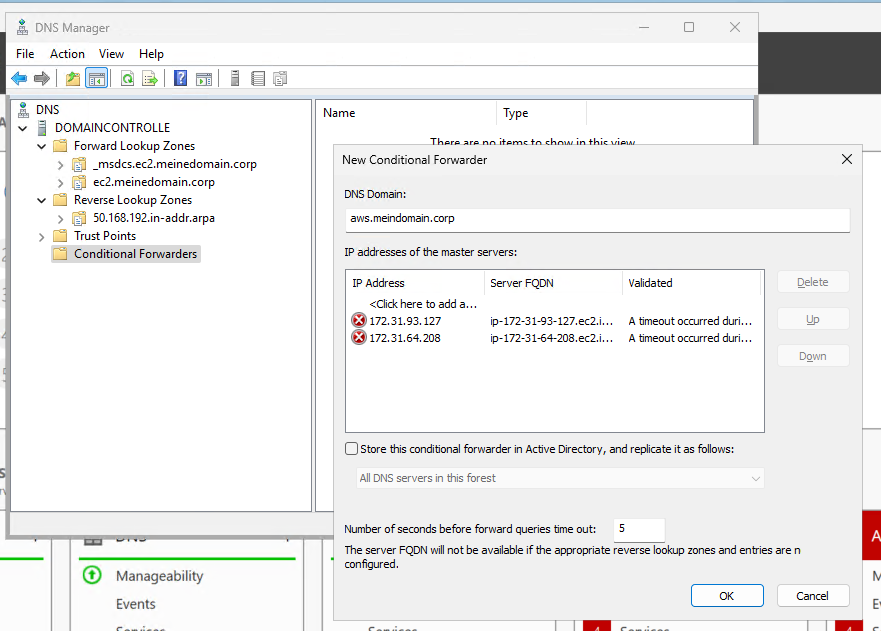
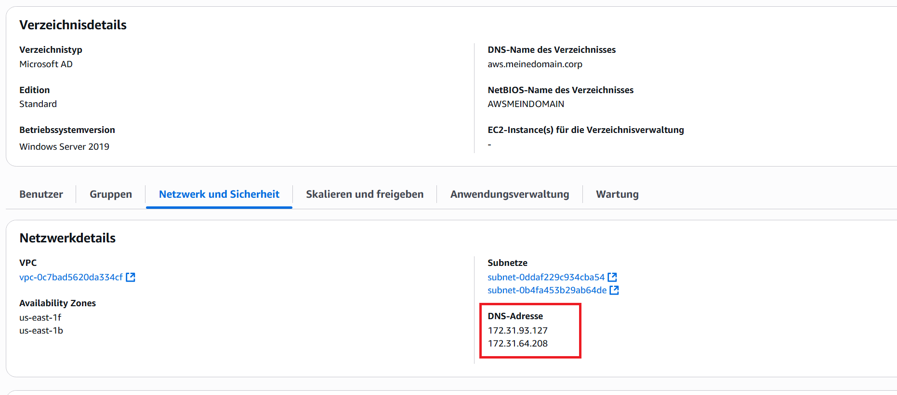
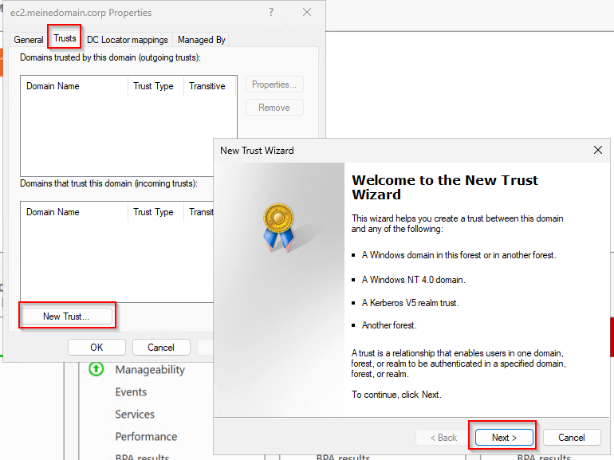
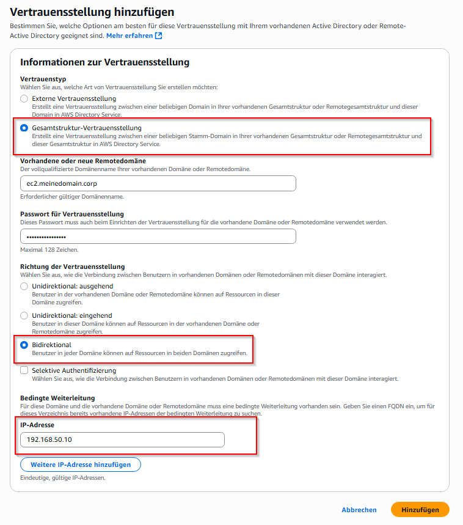
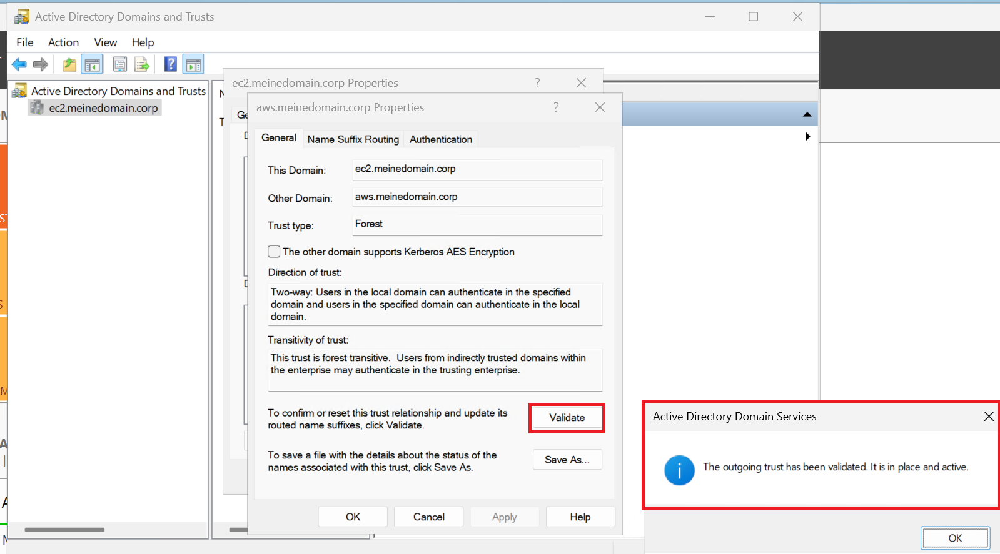

# AWS Managed AD / AD-Trust

## Ressourcen

- [Bewertungskriterien](../../../08_Kompetenznachweise/LB2/Kompetenzmatrix-LB2.md)
- [01_A_Planung_AD & Cloud Setup Sheet](../01_Planung/resources/01_A_Planung_AD_&_Cloud_Setup_Sheet.md)

## AWS Managed AD Domain

> [!IMPORTANT]
>
> Tragen Sie das von Ihnen hier festgelegte Passwort unbedingt bei Ihrer Planung ein.

| Schritte  | Printscreens                  |
| --------- | ----------------------------- |
| Schritt 1 |  |
| Schritt 2 |  |
| Schritt 3 |  |
| Schritt 4 |  |
| Schritt 5 |  |

## Ports aus der Planung nochmal sicherstellen

Sofern die Ports wie geplant eingerichtet wurden, kann mit der Einrichtung des Trusts begonnen werden.

## Conditional Forwarders

Damit Ihr Active Directory in EC die AWS-Managed-Domain sehen kann, muss ein sogenannter Conditional Forwarder eingerichtet werden. Normalerweise gehen AD-Abfragen immer an den eigenen DNS-Server des Active Directory. Da wir bei dieser Abfrage jedoch einen DNS-Server ausserhalb von `ec2.meinedomain.corp` abfragen müssen, benötigen wir diese bedingte Weiterleitung.

> [!TIP]
>
> Testen Sie den Conditional Forwader mit nslookup zb mit `nslookup -type=SOA aws.meinedomain.corp`
>

## Trust einrichten

### EC2 AD

Gehen Sie auf Active Directory Domain and Trusts -> Eigenschaften auf Ihre Domain

| Schritte  | Printscreen                               |
| --------- | ----------------------------------------- |
| Schritt 1 |  |
| Schritt 2 |  |
| Schritt 3 |  |
| Schritt 4 |  |
| Schritt 5 |  |
| Schritt 6 |  |
| Schritt 7 |  |

### AWS managed AD

| Schritte  | Printscreens                                  |
| --------- | --------------------------------------------- |
| Schritt 1 |  |
| Schritt 2 |  |
| Schritt 3 |  |
| Schritt 4 |  |

### Trust validieren

Nachdem beide Seiten eingerichtet sind kann die Validierung auf dem EC2 Active Directory gemacht werden

 
