# RSAT Tools + Admin Center V2 (WAC)

- ## Ressourcen

  - [Bewertungskriterien](../../../08_Kompetenznachweise/LB2/Kompetenzmatrix-LB2.md)
  - [01_A_Planung_AD & Cloud Setup Sheet](../01_Planung/resources/01_A_Planung_AD_&_Cloud_Setup_Sheet.md)

- Neue EC2-Client Instanz innerhalb AWS managed AD
- RSAT Tools für die Verwaltung des AWS Managed AD
- Das Admin Center V2 erfolgreich zu installieren und anmelden
- Den Domain Controller vom EC2 AD erfolgreich hinzuzufügen und über das Admin Center verwalten zu können
-  Das Admin Center via HTTPS oder RDP von aussen verfügbar machen mit entsprechende Sicherheitsüberlegungen (Dokumentation)

> [!NOTE]
>
> Natürlich wäre es auch sinnvoll die DC's der AWS Managed AD zum Admin Center hinzuzufügen. Dies ist aber leider nicht möglich, da AWS dies nicht zulässt. Deshalb fügen wir nur den DC aus dem EC2 AD hinzu. 

## EC2 Instanz aufsetzen

Machen Sie sich Gedanken wie und wo Sie das Admin Center (WAC) aufsetzen. In einem `private-subnet` oder in einem `public-subnet`? Gibt hier ein richtig oder falsch? Begründen Sie in der Dokumentation warum Sie folgende Variante verwendet haben und wie Sie in Zukunft auf das Admin Center zugreifen. 

## RSAT Tool installieren

Eine Möglichkeit für die Verwaltung der Domäne neben dem Admin Center sind die `Remote Server Administration Tools`. 

```
Install-WindowsFeature -Name RSAT -IncludeAllSubFeature -IncludeManagementTools
```

Installieren Sie diese damit wir in der AWS Managed AD Einstellungen an Objekten vornehmen können.

Anschliessend stehen folgende Konsolen zur Verfügung

`dsa.msc` – Active Directory-Benutzer und -Computer

`gpmc.msc` – Gruppenrichtlinien-Verwaltung

`dnsmgmt.msc` – DNS-Verwaltung

Dokumentieren Sie nun wie Sie Objekte in der AWS Managed AD hinzufügen bzw. bearbeiten können.

## Admin Center Server in AWS Managed Domäne hinzufügen

- Sie müssen den primären und sekundären DNS-Server vom Admin Center Server anpassen.
- Nun können Sie das Admin Center zum Domänen Mitglied hinzufügen und danach  das System neu starten

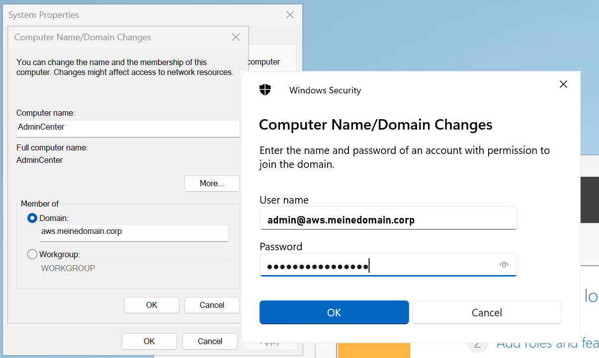

> [!TIP]
>
> Denken Sie daran dass Sie ab sofort an diesem System nicht mehr mit den lokalen Anmeldedaten anmelden sollten (Ausser beim Admin Center selbst, dort findet die Anmeldung nach wie vor über einen lokalen Benutzer statt)

## Admin Center Setup

Das Setup für das Admin Center ist bei der Windows-Server-2025-Version von AWS bereits vorhanden. Suchen Sie mit dem folgenden Befehl heraus, wo sich die EXE-Datei für die Installation auf dem System befindet.

```
Get-ChildItem -Recurse -Path C:\ -Filter *AdminCenter*.exe -ErrorAction SilentlyContinue
```

#### NAT-Gateway

Das Setup braucht Internet. Wenn Ihre EC2 Instanz in einem privaten Subnetz erstellt haben, müssen Sie einen NAT-Gateway erstellen und diesen als Route in ihrem privaten Subnetz einrichten.

| Schritte                                                     | Printscreens                                  |
| ------------------------------------------------------------ | --------------------------------------------- |
| Schritt 1 (Der NAT-Gateway muss in einem "public" Subnetz erstellte werden) | 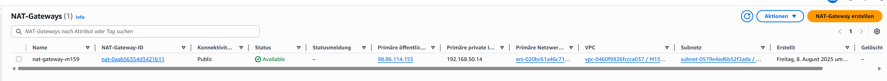 |
| Schritt 2 (Bearbeiten Sie die Routingtabelle des privaten Subnetzes) | 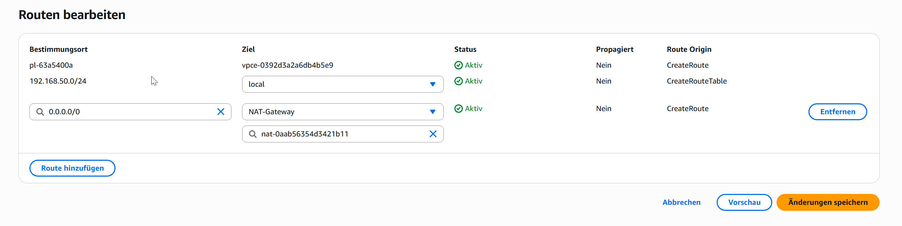  |
| Schritt 3                                                    | 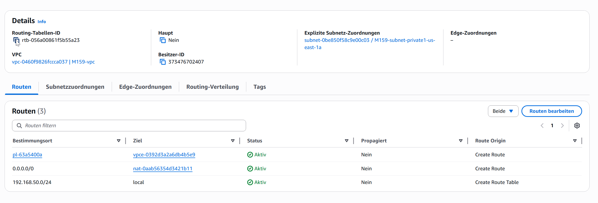  |

## Admin Center installieren

Bei den Schritten wo ein Printscreen fehlt müssen Sie selbst entscheiden. Fast immer ist der Standardwert die richtige Wahl.

| Schritte                                                     | Printscreen                                                  |
| ------------------------------------------------------------ | ------------------------------------------------------------ |
| Schritt 1                                                    |  |
| Schritt 2                                                    | 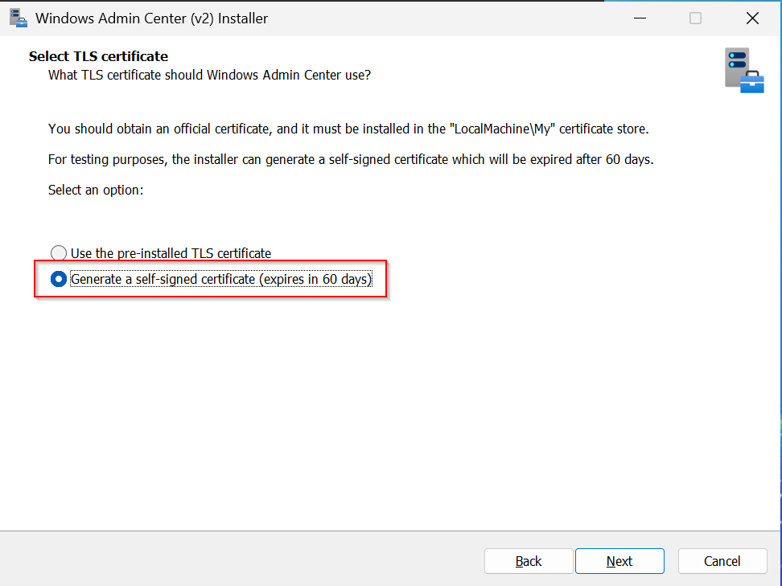 |
| Schritt 3                                                    | 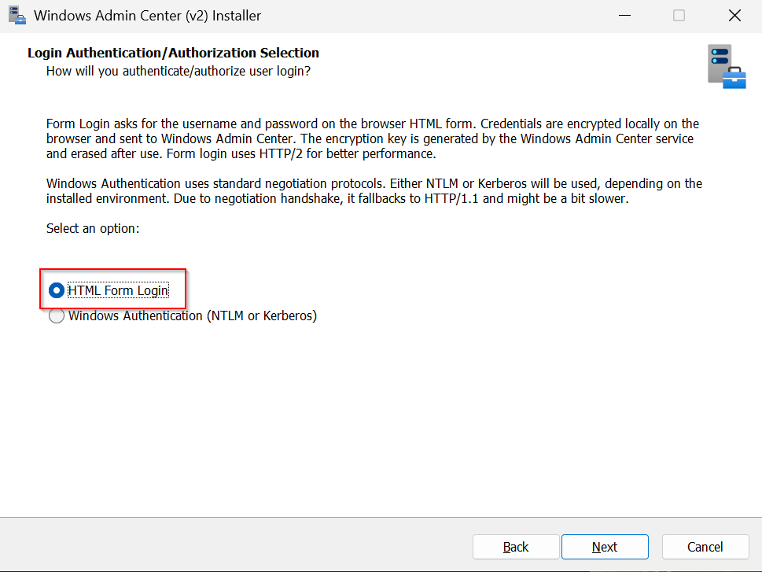 |
| Schritt 4                                                    | 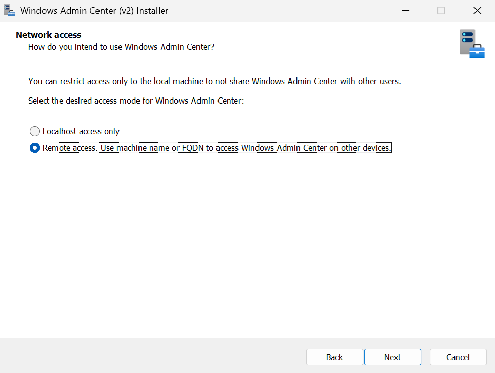 |
| Schritt 5                                                    | 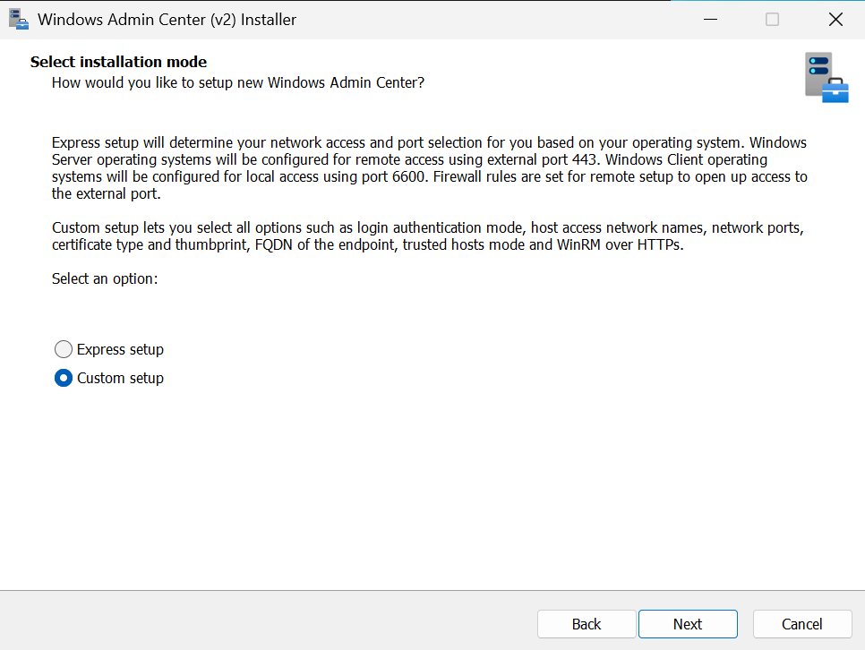 |
| Schritt 6 (Melden Sie sich mit dem lokalen Administrator an) | 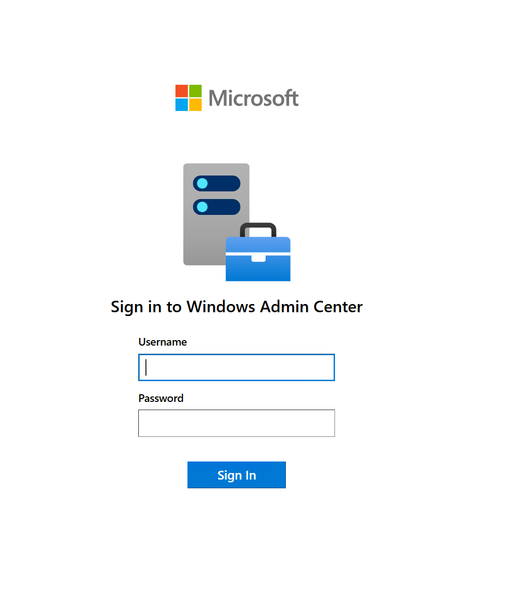                                |
| Schritt 7                                                    | Evtl. DC                                                     |

## DC aus EC2 AD zum Admin Center hinzufügen

Damit Sie den DC zum Admin Center hinzufügen können müssen Sie für WinRM folgende Ports freigeben

| Protokoll | Port | Richtung | Quelle                                   |
| --------- | ---- | -------- | ---------------------------------------- |
| TCP       | 5985 | Ingress  | IP der Admin Center-Instanz oder Subnetz |
| TCP       | 5986 | Ingress  | IP der Admin Center-Instanz oder Subnetz |

> [!WARNING]
>
> **Nicht `0.0.0.0/0` verwenden**, sondern möglichst einschränken auf die **interne VPC-Range oder die IP des Admin Centers**.

| Schritte                                   | Printscreens / Befehle                                       |
| ------------------------------------------ | ------------------------------------------------------------ |
| Schritt 1(WinRM aktivieren)                | 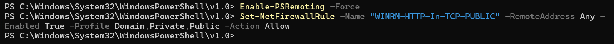 `Enable-PSRemoting -Force` |
| Schritt 2 (Windows Firewall konfigurieren) | # Regel für HTTP (Port 5985)<br/>`Set-NetFirewallRule -Name "WINRM-HTTP-In-TCP-PUBLIC" -RemoteAddress Any -Enabled True -Profile Domain,Private,Public -Action Allow`<br/><br/># Optional: HTTPS (Port 5986) – nur wenn konfiguriert<br/>`Set-NetFirewallRule -Name "WINRM-HTTPS-In-TCP" -RemoteAddress Any -Enabled True -Profile Domain,Private,Public -Action Allow` |
| Schritt 3 Verbindung testen                | 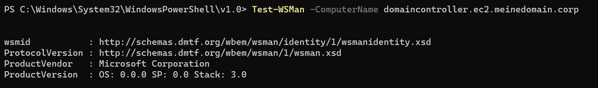                          |
| Schritt 4                                  | 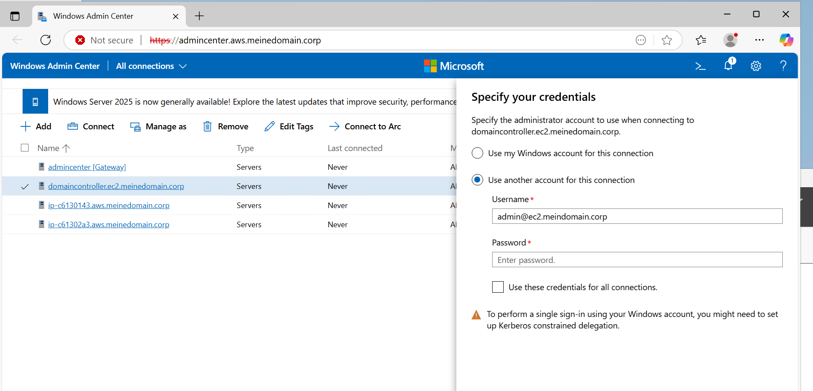    |
