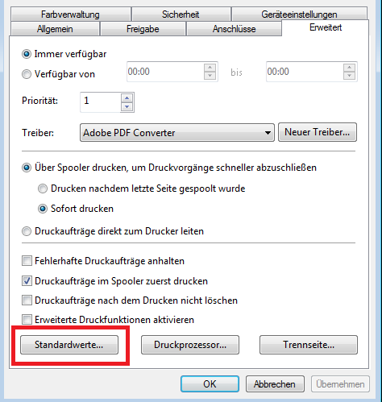
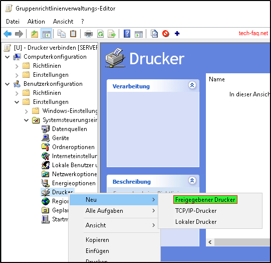

# Directory Information Tree & Arbeiten mit Gruppenrichtlinien (GPO)

## Ressourcen

- [Bewertungskriterien](../../../08_Kompetenznachweise/LB2/Kompetenzmatrix-LB2.md)
- Wichtige Befehle

  - `gpupdate /force`
  - `gpresult /r`

Bevor Sie mit der Aufgabe beginnen, lesen Sie das Kapitel «5.2.1 OUs und Gruppenrichtlinien» im Dokument Gruppenrichtlinien-Kapitel5.pdf 9 ([GPO-Unterlagen](../../../02_Unterrichtsressourcen/03_Fachliteratur&Tutorials\GPO))

## DIT erstellen

- Erstellen Sie aus den nachfolgenden Daten einen passenden DIT in einem visuell dafür vorgesehenen Tool. Zum Beispiel Visio oder «https://draw.io».
- Erstellen Sie für einen User und einen Computer den DN direkt im Diagramm gut ersichtlich.

Richtlinien für den DIT:

- Jede Abteilung darf in diesem DIT nur einmal als Organisationseinheit vorkommen
- intern und extern soll als eigenständige Ebene vorkommen 
- Achten Sie darauf, dass Sie eindeutige Namen verwenden
- Die letzte Ebene soll immer zwischen Benutzer- und Computerkonten aufteilen

| Standort 1                 | Standort 2                     |
| -------------------------- | ------------------------------ |
| •	GL (intern)           | •	GL (intern)               |
| •	Sekretariat (intern)  | •	Aussendienst (extern)     |
| •	Aussendienst (extern) | •	Promoter (extern          |
| •	Buchhaltung (intern)  | •	Messemitarbeiter (extern) |
| •	Promoter (extern)     | •	Partner (extern)          |
| •	Partner (extern)      | •	Informatik (intern)       |
| •	Informatik (intern)   |                                |

## Struktur im AD anlegen 

Wenn Sie sicher sind, dass Sie eine gute Struktur haben, legen Sie Ihre im DIT definierte Struktur im AD an. 

## Verschieben Sie alle Benutzer in die passenden OUs 

- Kontrolle graphisches DIT 
- Zeigen Sie die erstellen OU’s

# Gruppenrichtlinien

In dieser Aufgabe vertiefen Sie Ihre Kenntnisse im Umgang mit Gruppenrichtlinien in einer Active Directory Umgebung. Sie werden unterschiedliche Szenarien umsetzen – von der Anpassung von Passwortrichtlinien über die Verteilung von Ressourcen wie Netzlaufwerke, Desktop-Verknüpfungen, Drucker und Software, bis hin zur Arbeit mit WMI-Filtern.

Zur Vorbereitung lesen Sie bitte die relevanten Kapitel aus den bereitgestellten PDFs ([GPO-Unterlagen](../../../02_Unterrichtsressourcen/03_Fachliteratur&Tutorials\GPO))

- Gruppenrichtlinien-Kapitel1.pdf
- Gruppenrichtlinien-Kapitel2.pdf
- Gruppenrichtlinien-Kapitel3.pdf
- Gruppenrichtlinien-Kapitel5.pdf (Abschnitt 5.4 Benennung von GPOs)
- Gruppenrichtlinien-Kapitel6.pdf (bis Kapitel 6.5)

---

## Teil 1: Passwortrichtlinien in der Default Domain Policy anpassen

> **Wichtig:** Ändern Sie in den Standardrichtlinien nur die Passwortrichtlinien, keine weiteren Einstellungen.
1. Öffnen Sie die **Default Domain Policy**.
2. Deaktivieren Sie:
   - Passwortkomplexität
   - Erzwingen einer Passwortänderung nach einer bestimmten Zeit
3. Diese Einstellungen gelten nur für die Testumgebung.

---

## Teil 2: Netzlaufwerke per GPO verteilen
1. Erstellen Sie neue GPOs zur Bereitstellung von Netzlaufwerken, unter Beachtung der Namenskonventionen aus **Kapitel 5.4**.
2. Die Bereitstellung der Laufwerke soll über die GPO-Verknüpfung mit den korrekten OU's erfolgen und nicht über die Zielgruppenadressierung.
3. Folgende Laufwerke sollen bereitgestellt werden:
   - `Pool` für die gesamte Firma
   - Abteilungslaufwerk für jede Abteilung
   - `Intern` für alle internen Abteilungen
   - `Extern` für alle externen Abteilungen

---

## Teil 3: Desktop-Verknüpfung mit positiver Sicherheitsfilterung
1. Erstellen Sie ein GPO, das eine Desktop-Verknüpfung zum Web-CRM (`https://crm.webapp.ch`) erstellt.
2. Verknüpfen Sie das GPO auf oberster Ebene.
3. Verwenden Sie **positive Sicherheitsfilterung**, um nur bestimmten Gruppen (`intern`) die Verknüpfung bereitzustellen.
4. Entfernen Sie nicht benötigte Gruppen und testen Sie die Verteilung.

---

## Teil 4: GPO mit WMI-Filter
1. Erstellen Sie einen WMI-Filter, der nur **Windows 10**-Installationen erkennt (siehe Kapitel 4.3).
2. Erstellen Sie ein neues GPO **"Textdatei kopieren"** und verknüpfen Sie es mit der OU `Promoter`.
3. Wenden Sie den WMI-Filter auf dieses GPO an.
4. Erstellen Sie auf der Freigabe `Pool` die Datei `WMI-Filter.txt` (leer).
5. Konfigurieren Sie das GPO so, dass die Datei bei allen Benutzern der OU `Promoter` nach `%temp%` kopiert wird.
   - Dateiname muss im Zielpfad angegeben werden.
   - Aktivieren Sie **"Im Sicherheitskontext des angemeldeten Benutzers ausführen"**.
6. Exportieren Sie mit `gpresult /h gpo.html` eine HTML-Auswertung und speichern Sie diese in Teams.

---

## Teil 5: Farb- und SW-Drucker verteilen
1. Installieren Sie einen fiktiven Farblaserdrucker zweimal mit einer fiktiven IP-Adresse:
   - **Drucker_Farbe** (Standardfarbeinstellung: Farbe)
   - **Drucker_SW** (Standardfarbeinstellung: Schwarzweiß)

2. Passen Sie die **Standardwerte** an, damit diese Einstellungen übernommen werden.

   

3. Geben Sie beide Drucker frei.

4. Erstellen Sie ein GPO, das beide Drucker per UNC-Pfad (`\\FQDN\Druckerfreigabename`) verteilt.

   

5. Verwenden Sie die Aktion **"Ersetzen"** oder **"Aktualisieren"**.

6. Testen Sie die Verteilung, indem Sie die Drucker löschen und mit `gpupdate /force` neu hinzufügen lassen. Dokumentieren Sie dies per Video.

---

## Teil 6: MSI-Paket per GPO verteilen
1. Erstellen Sie einen Freigabeordner für die Bereitstellung.
2. Laden Sie das aktuelle **7-Zip MSI** herunter.
3. Erstellen Sie ein GPO(Computereinstellung), um das MSI-Paket auf Clients in der Domäne zu installieren. Verknüpfen Sie dieses GPO-Objekt mit der gesamten Domain.
4. Erstellen Sie eine Security Group "7-Zip" und steuern Sie über das Item-Level-Targeting (Zielgruppenadressierung), dass nur Computer in der entsprechende Gruppe die Installation von 7-Zip erhalten.
5. Falls Fehler **%%1274** auftreten:
   - Setzen Sie auf der Freigabe Lese-Berechtigungen für **"Jeder"**/**"Everyone"**.
6. Dokumentieren Sie die erfolgreiche Installation über die Ereignisanzeige (Eventlog).

---

## Abgabe
- Videos, Screenshots und Exportdateien (`gpo.html`) im Repository ablegen. (gpresult /h «gpo.html»)
