# MS Entra ID & MS Entra Connect

## Ressourcen

- [Bewertungskriterien](../../../08_Kompetenznachweise/LB2/Kompetenzmatrix-LB2.md)
- `Start-ADSyncSyncCycle -PolicyType Initial` / `Start-ADSyncSyncCycle -PolicyType Delta` Zwei Befehle für den Entra ID Sync (Initial oder Delta)
- `dsregcmd /status` (Befehl zur Überprüfung der hybriden Mitgliedschaft)

## Azure for Students

Um eine Azure-Umgebung mit 80 $ Guthaben und einem eigenen Tenant zu erhalten, müssen Sie zunächst diese Anleitung befolgen.

[Anleitung für Freischaltung mit neuer nicht TBZ-E-Mail](../../..//02_Unterrichtsressourcen/03_Fachliteratur&Tutorials/Azure/QRC_AzureForStudents.pdf) (Wenn Sie Ihre private E-Mail-Adresse nicht verwenden möchten, können Sie beispielsweise eine Gmail-Adresse erstellen.)

## Entra ID Connect einrichten

| Schritte                                                     | Printscreens                                              |
| ------------------------------------------------------------ | --------------------------------------------------------- |
| Schritt 1                                                    | 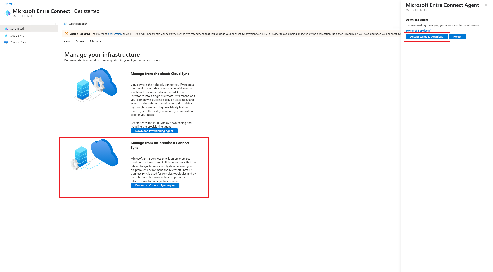           |
| Schritt 2 (Installation )                                    | 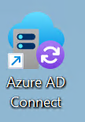                             |
| Schritt 3 (Dass der Suffix nicht machted ist grundsätzlich kein Problem, es wäre aber möglich dies bereits jetzt mit dem öffentlichen Suffix einzurichten, damit dies später nicht mehr gemacht werden muss) | 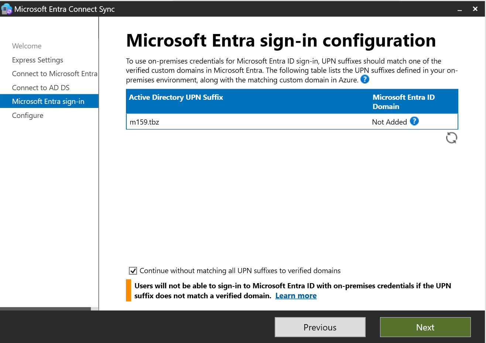 |
| Schritt 4                                                    | - Password Hash Synchronization (YES)                     |
| Schritt 5                                                    | 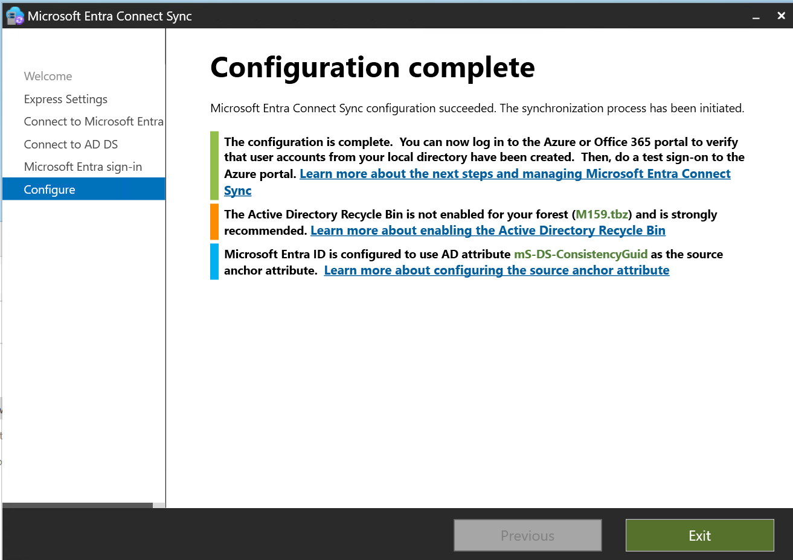                       |
| Schritt 6                                                    | 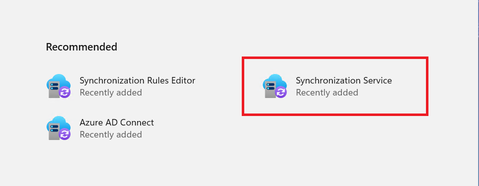                         |
| Schritt 7 (Wenn Sie diese Ansicht sehen, wissen Sie dass die Synchronsiserung funktioniert) | 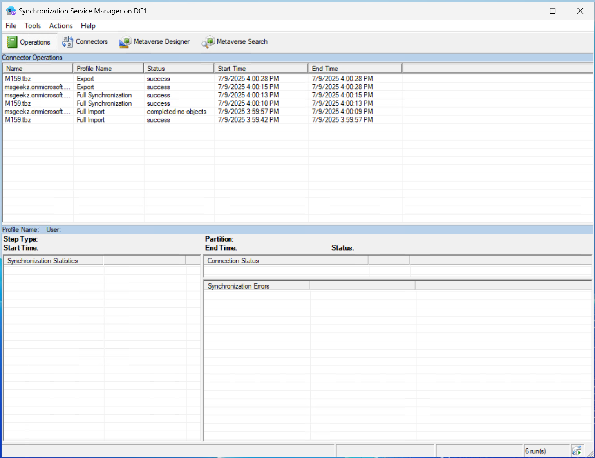                           |

## Custom-UPN (Domain) zu EntraID hinzufügen

| Schritte  | Printscreens                  |
| --------- | ----------------------------- |
| Schritt 1 | 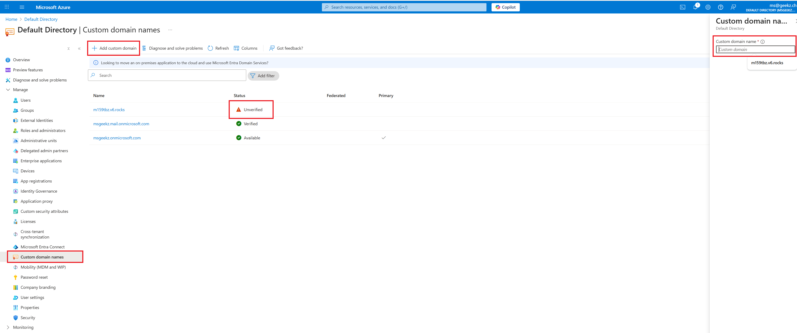 |
| Schritt 2 | 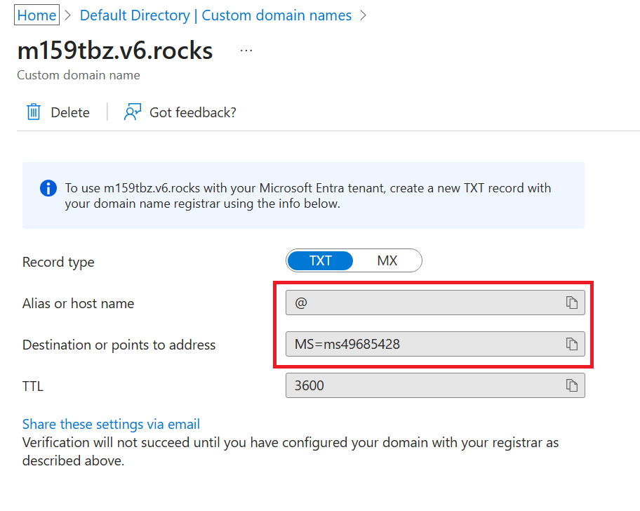 |
| Schritt 3 | 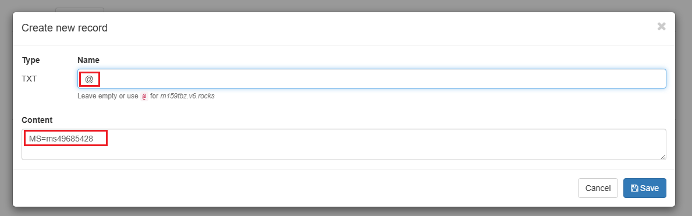 |
| Schritt 4 | 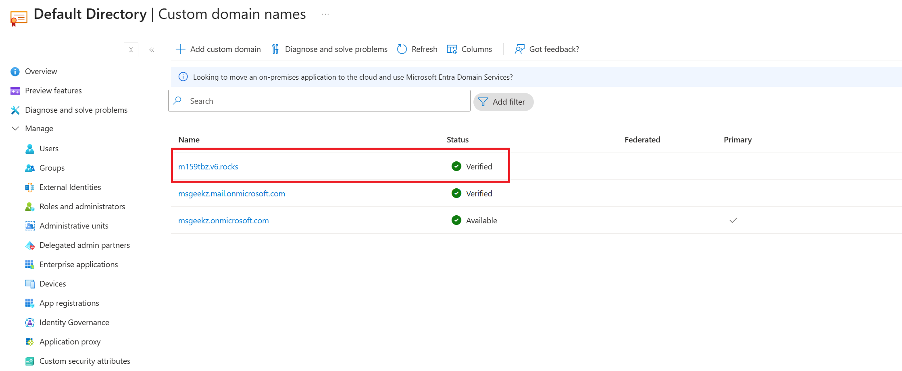 |
| Schritt 5 |                               |

## Custom-UPN (Domain) zum EC2 Active Directory hinzufügen

## MS Entra AD (Hybrid-Join)

| Schritte   | Printscreens                                        |      |
| ---------- | --------------------------------------------------- | ---- |
| Schritt 1  |          |      |
| Schritt 2  | 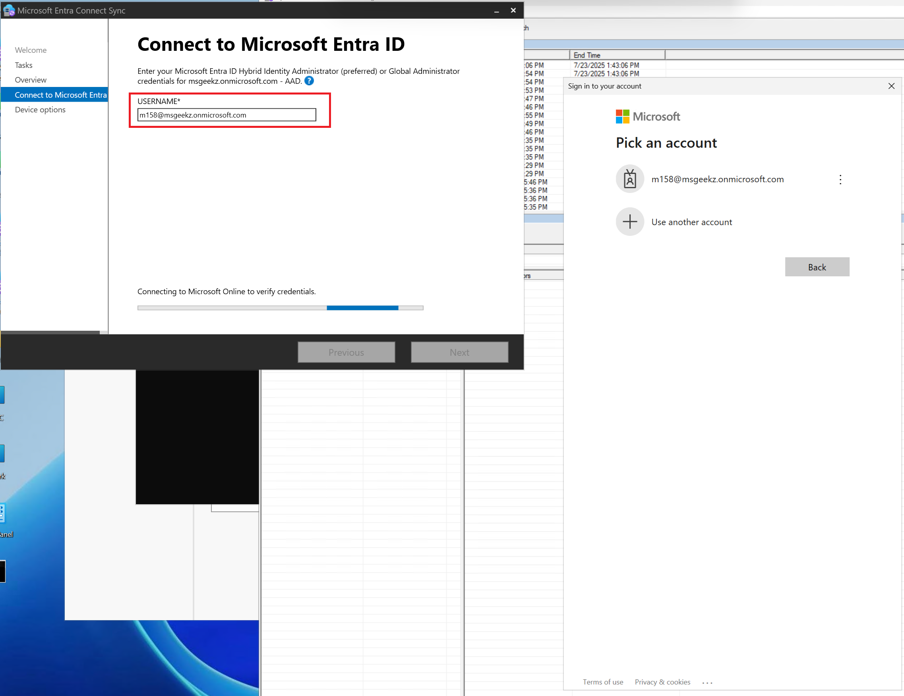         |      |
| Schritt  3 | 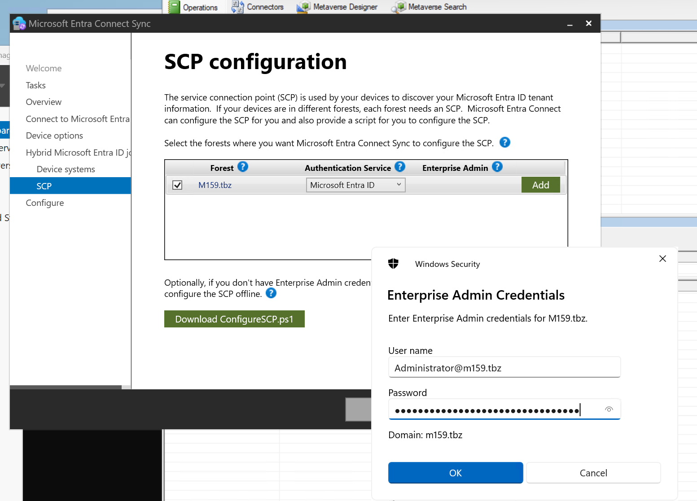         |      |
| Schritt 4  | 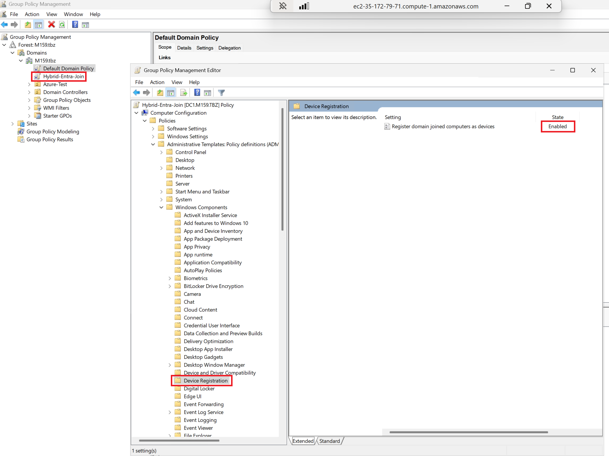 |      |
| Schritt 5  | 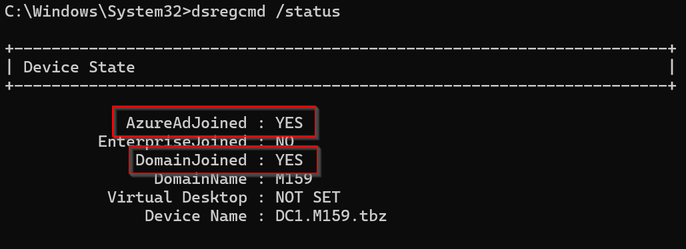                         |      |

