# SSO Python App

## Ressourcen

- [Bewertungskriterien](../../../08_Kompetenznachweise/LB2/Kompetenzmatrix-LB2.md)
- `Invoke-WebRequest -Uri "https://www.python.org/ftp/python/3.12.1/python-3.12.1-amd64.exe" -OutFile "python-installer.exe"`
- `Start-Process -FilePath ".\python-installer.exe" -ArgumentList "/quiet InstallAllUsers=1 PrependPath=1" -Wait`
- `python --version`
- `pip install -r .\requirements.txt`

In dieser Aufgabe sollen Sie eine Python-App lokal starten und eine SSO-Anmeldung simulieren. 

> [!IMPORTANT]
>
> SSO kann über Printscreens schlecht überprüft werden. Daher müssen Sie unbedingt ein Video erstellen, in dem zu sehen ist, dass der Passwort-Prompt nicht erscheint.

## Python SSO-App starten

| Schritt                               | Beschreibung                                                 | Printscreens |
| ------------------------------------- | ------------------------------------------------------------ | ------------ |
| **1 – Python herunterladen**          | Gehe auf [https://www.python.org/downloads/](https://www.python.org/downloads/) und lade die aktuelle stabile Version (z. B. Python 3.12.x) für Windows herunter oder verwende den PowerShell-Befehl aus den Resourcen. (Oder PowerShell Befehl von Ressourcen verwenden) |              |
| **2 – Python installieren**           | Starte das Installationsprogramm und **aktiviere die Option „Add Python to PATH“**. Wähle Standard- oder benutzerdefinierte Installation. (Oder PowerShell Befehl von Ressourcen verwenden) |              |
| **3 – Python-Version prüfen**         | Öffne **PowerShell** und tippe(Wenn PowerShell bereits offen war müssen Sie die Shell neu starten): `python --version` Die Version sollte angezeigt werden (z. B. `Python 3.12.5`). |              |
| **4 – In Projektordner wechseln**     | Navigiere in PowerShell in den Ordner, in dem sich deine Flask-App befindet: `cd Pfad\zu\deinem\sso-python-app` |              |
| **5 – Virtuelle Umgebung erstellen**  | Führe aus: `python -m venv venv` Dadurch wird ein Ordner **`venv`** mit der isolierten Python-Umgebung erstellt. |              |
| **6 – Virtuelle Umgebung aktivieren** | Führe aus: `venv\Scripts\Activate` Wenn erfolgreich, siehst du `(venv)` am Anfang der Eingabezeile. |              |
| **7 – Abhängigkeiten installieren**   | Falls vorhanden, installiere alle benötigten Pakete aus der `requirements.txt`: `pip install -r requirements.txt` Falls keine vorhanden ist, installiere manuell: `pip install flask authlib python-dotenv` |              |
| **8 – Flask-App starten**             | Setze den App-Namen: `set FLASK_APP=app.py` PowerShell neustarten Starte dann die App: `flask run` oder `python -m flask run` Die App läuft jetzt auf `http://localhost:5000`. |              |

## Python App in Entra-ID registrieren (App-Registration)

| Schritte                                                     | Printscreen                                                  |
| ------------------------------------------------------------ | ------------------------------------------------------------ |
| Schritt 1 - App inkl. "callback" in Entra ID registrieren    | 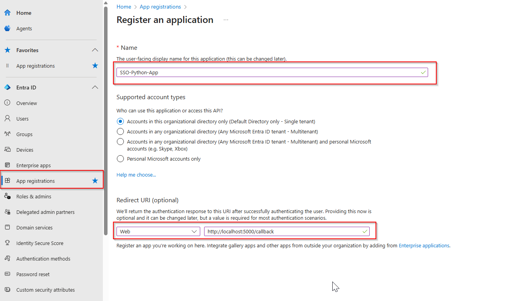          |
| Schritt 2 - Client Secret erstellen (Speichern Sie das Client-Secret sofort in der Planung, da es zu einem späteren Zeitpunkt nicht mehr kopiert werden kann.) | 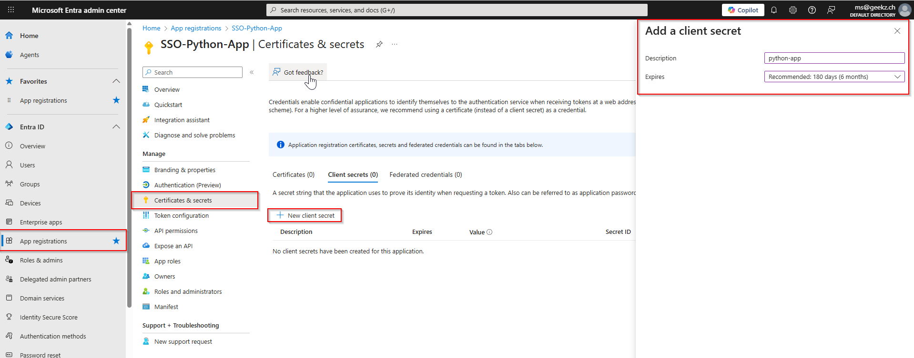 |
| Schritt 3 - Umgebungsvariablen in der Python-App eintragen (Suchen Sie in der python-app nach einer .env Datei und tragen Sie dort die folgenden Values ein) - Client ID - Client Secret - Tenant ID | 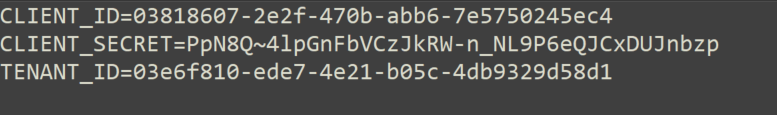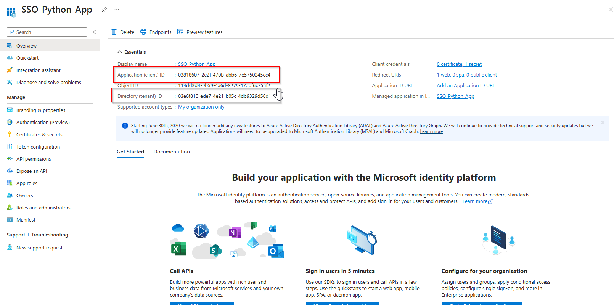 |
|                                                              |                                                              |

# Login Test Chrome (Mit manueller Anmeldung)

| Schritte                                         | Printscreen                                                  |
| ------------------------------------------------ | ------------------------------------------------------------ |
| Schritt 1: Python Applikation im Browser starten | 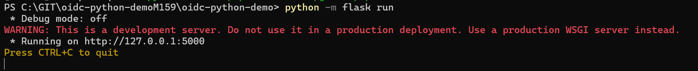**Achtung**: Hier wird ausgegeben, dass die App unter http://127.0.0.1:5000 erreichbar ist. Da wir in Entra ID jedoch http://localhost:5000 definiert haben, ist es wichtig, dass Sie die App auch über diese Adresse aufrufen, da es sonst zu einem **Redirect URI Mismatch** führt. |
| Schritt 2: Mit Chrome testen (Inkognito)         | 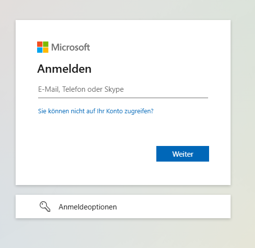                                |
| Schritt 3: Berechtigungen akzeptieren            | 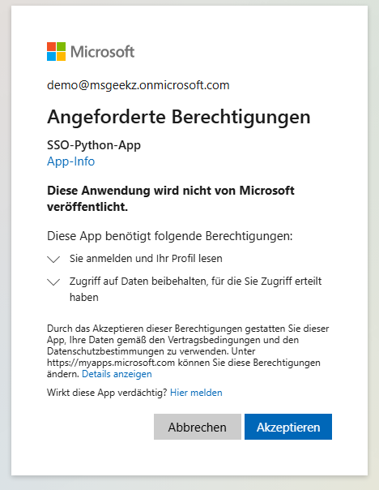 |
| Schritt 4: Success                               | 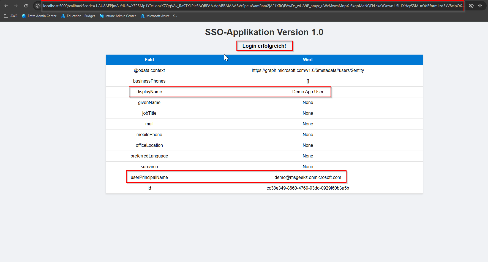    |

# Login-Test in Chrome (mit Token-basierter SSO)

Testen Sie dieses Szenario mit einem Client, der kein Mitglied von EC2 Active Directory und/oder Entra ID ist.

| Schritte                                                     | Printscreen                                                  |
| ------------------------------------------------------------ | ------------------------------------------------------------ |
| Schritt 1: Python Applikation im Browser starten             | **Achtung**: Hier wird ausgegeben, dass die App unter http://127.0.0.1:5000 erreichbar ist. Da wir in Entra ID jedoch http://localhost:5000 definiert haben, ist es wichtig, dass Sie die App auch über diese Adresse aufrufen, da es sonst zu einem **Redirect URI Mismatch** führt. |
| Schritt 2: Melden Sie sich mit einem Entra-ID Benutzer z.B. bei MS 365 an. (https://m365.cloud.microsoft/) | 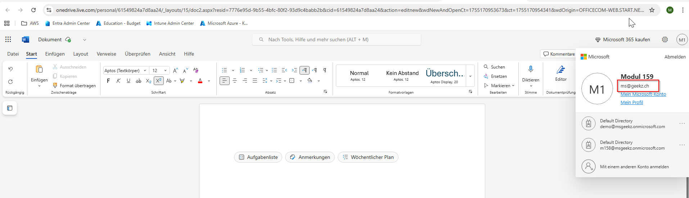               |
| Schritt 4                                                    |                                                              |
| Schritt 4: Nun kann der Login ohne zusätzliche Passworteingabe funktionieren. | 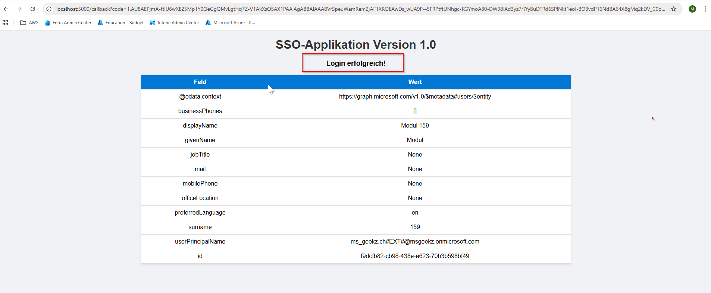            |

# Login-Test in Edge (Klassisches Kerberos-/WIA-SSO)

| Schritte                                                     | Printscreen                                                  |
| ------------------------------------------------------------ | ------------------------------------------------------------ |
| Schritt 1: Python Applikation im Browser starten             | **Achtung**: Hier wird ausgegeben, dass die App unter http://127.0.0.1:5000 erreichbar ist. Da wir in Entra ID jedoch http://localhost:5000 definiert haben, ist es wichtig, dass Sie die App auch über diese Adresse aufrufen, da es sonst zu einem **Redirect URI Mismatch** führt. |
| Schritt 2: Nun kann man ohne Passworteingabe (https://m365.cloud.microsoft/) öffnen. In diesem Beispiel wurde ein neuer SSO-Benutzer für den Test erstellt. Beachten Sie unbedingt, dass der Benutzer unter dem öffentlichen UPN erstellt wurde. | 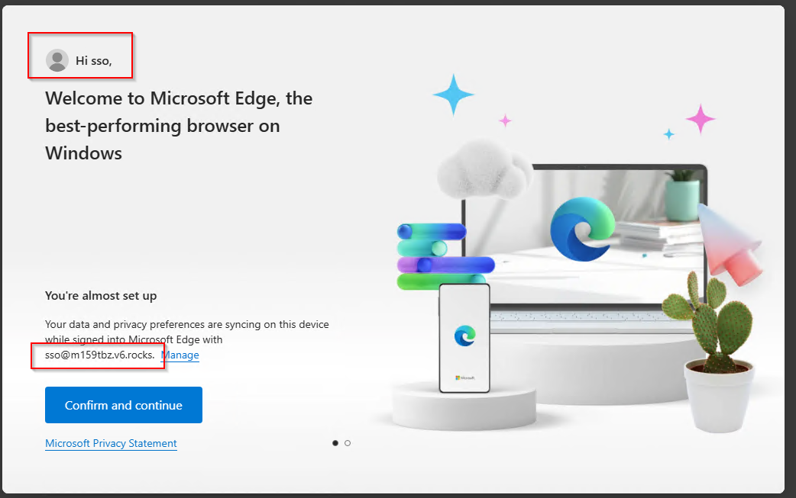                          |
| Schritt 3: Nun kann der Login ohne zusätzliche Passworteingabe funktionieren. |             |
